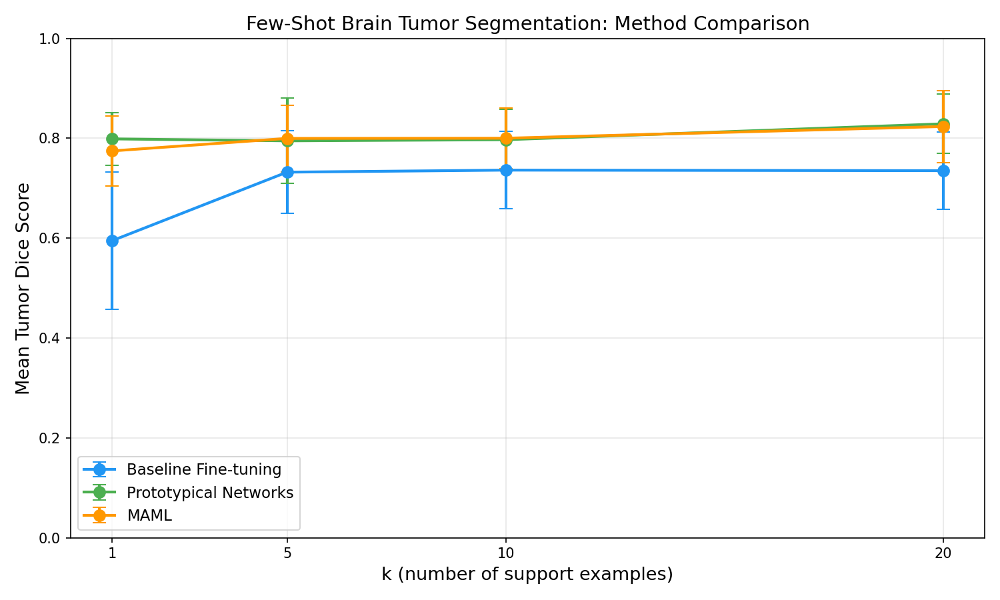
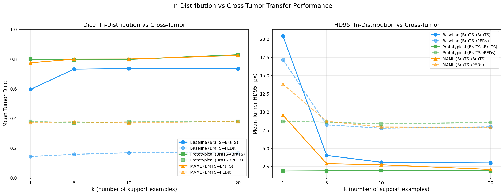
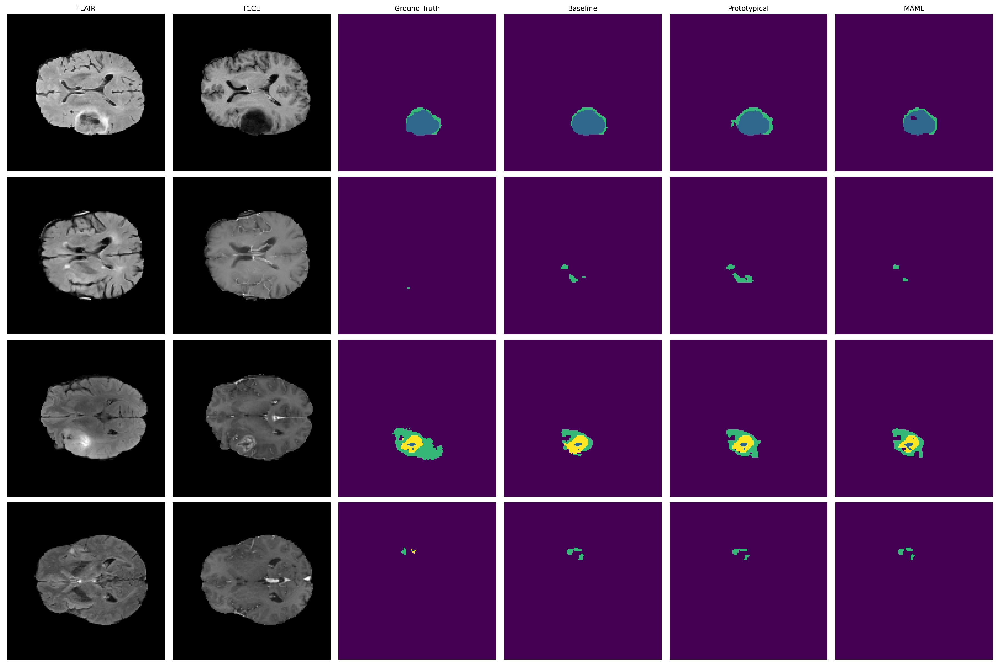
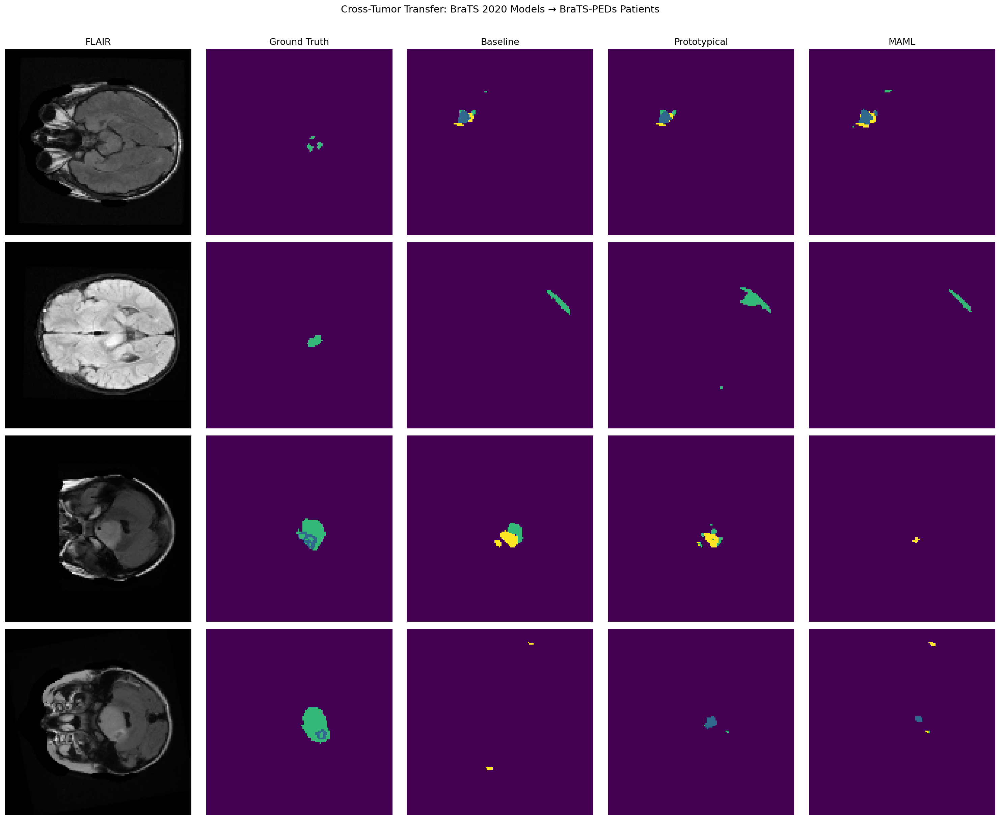
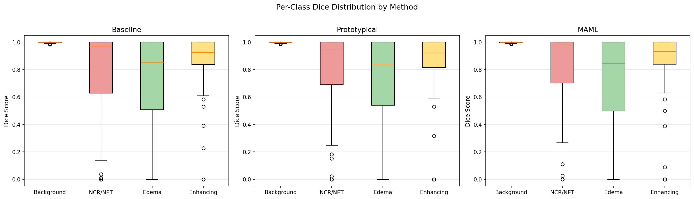
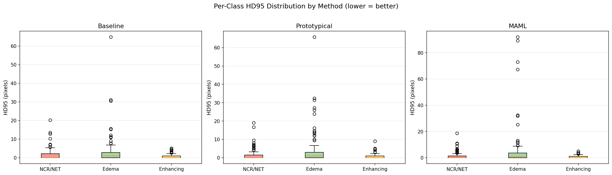
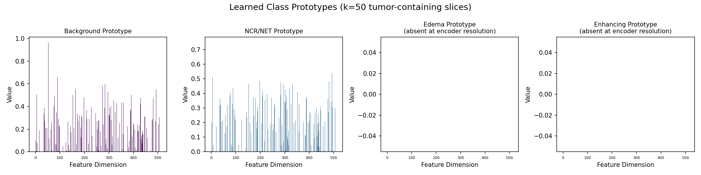
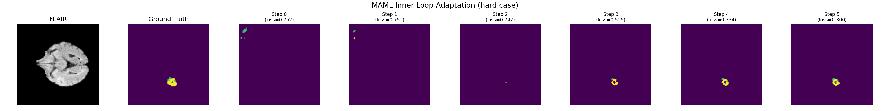
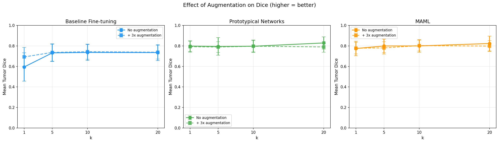

# Few-Shot Brain Tumor Segmentation with Meta-Learning

**CS7150 Deep Learning — Final Project**
**Yuzhe Li & Sherwin Vahidimowlavi | Northeastern University | Spring 2026**

Can we segment brain tumors with only 1–20 labeled examples? This project compares three few-shot adaptation strategies on the BraTS 2020 dataset — fine-tuning baseline, prototypical networks with gated attention, and MAML (first-order approximation) — and evaluates cross-tumor generalization on the BraTS-PEDs pediatric dataset.

---

## Key Results

### In-Distribution (BraTS 2020 → BraTS 2020)

| Method | k=1 | k=5 | k=10 | k=20 |
|---|---|---|---|---|
| Baseline Fine-tuning | 0.595 ± 0.137 | 0.732 ± 0.083 | 0.736 ± 0.078 | 0.735 ± 0.078 |
| **Prototypical Networks** | **0.799 ± 0.052** | 0.795 ± 0.086 | 0.797 ± 0.061 | **0.829 ± 0.059** |
| MAML (FOMAML) | 0.775 ± 0.070 | **0.800 ± 0.067** | **0.800 ± 0.061** | 0.823 ± 0.072 |

*Mean Tumor Dice Score (classes 1–3), 50 episodes per k value. Full supervision Dice: 0.737.*

Both meta-learning methods significantly outperform the baseline at every k, with the largest gap at k=1 (+0.204 for prototypical). Prototypical at k=20 (0.829) exceeds full supervision.



### Cross-Tumor Transfer (BraTS 2020 → BraTS-PEDs)

| Method | k=1 | k=5 | k=10 | k=20 |
|---|---|---|---|---|
| Baseline Fine-tuning | 0.143 ± 0.067 | 0.158 ± 0.063 | 0.168 ± 0.065 | 0.168 ± 0.073 |
| **Prototypical Networks** | **0.380 ± 0.071** | 0.370 ± 0.055 | **0.376 ± 0.067** | 0.379 ± 0.076 |
| MAML (FOMAML) | 0.372 ± 0.073 | **0.376 ± 0.066** | 0.369 ± 0.059 | **0.380 ± 0.071** |

*Mean Tumor Dice Score, 200 episodes per k value. Train: BraTS 2020 adult glioblastoma. Query: BraTS-PEDs pediatric high-grade glioma.*

**Performance Drop: In-Distribution → Cross-Tumor (Dice)**

| Method | k=1 | k=5 | k=10 | k=20 |
|---|---|---|---|---|
| Baseline | -0.452 (76% drop) | -0.574 (78% drop) | -0.568 (77% drop) | -0.567 (77% drop) |
| Prototypical | -0.419 (52% drop) | -0.425 (53% drop) | -0.421 (53% drop) | -0.450 (54% drop) |
| MAML | -0.403 (52% drop) | -0.424 (53% drop) | -0.431 (54% drop) | -0.444 (54% drop) |

Baseline loses ~77% of its performance on pediatric data. Prototypical and MAML lose ~53%. Meta-learning methods degrade more gracefully because they preserve pretrained features instead of destructively fine-tuning on out-of-distribution support examples.



---

## Context: Published Benchmarks

Direct comparison with published results is limited because most prior work on BraTS uses binary segmentation (tumor vs. background) rather than multi-subregion classification, and many use all 4 MRI modalities. Our task — 4-class segmentation from only FLAIR and T1CE — is strictly harder.

| Reference | Dataset | Task | Setup | Dice |
|---|---|---|---|---|
| **Ours (Prototypical)** | **BraTS 2020** | **4-class, 2ch** | **k=20, 50 eps** | **0.829** |
| **Ours (MAML)** | **BraTS 2020** | **4-class, 2ch** | **k=20, 50 eps** | **0.823** |
| **Ours (Baseline)** | **BraTS 2020** | **4-class, 2ch** | **Full supervision** | **0.737** |
| Balasundaram et al. 2023 | BraTS 2021 | Binary, 1ch (T2) | 1-shot | 0.834 |
| Kinagi et al. 2026 | BraTS 2021 | Binary, 2-way | 10-shot | 0.818 |
| Alsaleh et al. 2024 | TotalSeg | Organs, 3D | 5-shot MAML | 0.777–0.903 |
| MM-MSCA-AF 2025 | BraTS 2020 | 4-class, 4ch | Full supervision | 0.859 |
| Adv. nnU-Net 2024 | BraTS-Glioma | 3-region, 4ch | Full supervision | 0.830 |

Our prototypical network at k=20 (0.829) approaches full-supervision SOTA with 4 modalities (0.83–0.86) — using only 20 examples and 2 channels.

---

## Project Structure

```
UNet-FewShot/
├── configs/
│   ├── config.py              # Centralized hyperparameters and paths
│   ├── metrics.py             # Dice score, HD95, hd95_multiclass, evaluation loop
│   ├── model_utils.py         # Shared checkpoint loading
│   └── results_utils.py       # Save/load/print JSON results (preserves all fields)
├── data/
│   ├── dataset.py             # BraTSDataset — loads FLAIR + T1CE slices
│   ├── splits.py              # Consistent 70/20/10 train/val/test splits (seed=42)
│   ├── few_shot_sampler.py    # Episode sampling + k-shot fine-tune eval
│   ├── augmented_finetune.py  # Support set augmentation for all methods
│   └── synthetic_tumor_generator.py  # Synthetic tumor generation (experimental)
├── models/
│   ├── bu_net.py              # BUNet — ResNet34 U-Net (24.4M params)
│   ├── prototypical_segmentation.py  # Gated prototype-attention network
│   └── maml_segmentation.py   # FOMAML wrapper + trainer
├── training/
│   ├── trainer.py             # Supervised training loop (Dice loss)
│   └── prototypical_trainer.py # Episodic training with BN freeze
├── notebooks/
│   ├── 1_baseline_training.ipynb           # Train supervised U-Net
│   ├── 2_baseline_evaluation.ipynb         # K-shot fine-tuning evaluation
│   ├── 3_prototypical_training.ipynb       # Train + evaluate prototypical net
│   ├── 4_maml_training.ipynb               # Train + evaluate MAML
│   ├── 5_interpretability.ipynb            # Visualizations + method comparison
│   ├── 6_augmentation_ablation.ipynb       # Support set augmentation experiment
│   └── 7_cross_tumor_transfer_evaluation.ipynb  # BraTS 2020 → BraTS-PEDs transfer
├── results/                   # Saved JSON metrics + PNG figures
├── checkpoints/               # Model checkpoints (gitignored)
├── PKG - BraTS-PEDs-v1/       # BraTS-PEDs dataset (gitignored)
└── .gitignore
```

---

## Methods

### Baseline: Fine-Tuning
Pretrained ResNet34 U-Net (24.4M params). For each episode, deep-copy the model, fine-tune on k support slices for 10 gradient steps, then evaluate on query slices.

### Prototypical Networks (Gated Attention)
Compute per-class prototypes by masked averaging of encoder features from the support set. Generate cosine similarity attention maps and fuse with U-Net output:

```
output = UNet(query) × (1 + σ(gate) × attention)
```

The learnable gate starts at 0 (pure U-Net) and learns when to incorporate prototype guidance. BatchNorm layers are frozen during episodic training to preserve pretrained running statistics.

### MAML (First-Order Approximation)
First-order MAML (FOMAML) with 5 inner-loop SGD steps on the support set. Due to architectural constraints with SMP's U-Net, the outer loop trains on concatenated support+query data rather than backpropagating through the inner loop. This limitation is documented as a finding.

---

## Key Findings

1. **Preserving pretrained features > adaptation mechanism.** Both prototypical and MAML achieve ~0.80 Dice by avoiding destructive fine-tuning, while the baseline degrades to 0.595 at k=1 due to overfitting.

2. **Gated attention is critical.** Ungated prototype attention destroys the U-Net's calibration — Dice dropped to 0.248 without the gate. The gate learned to stay near zero, correctly ignoring unreliable edema and enhancing prototypes.

3. **BatchNorm freeze is essential.** Small episodic batches (10 images) corrupt batch statistics. Using stable running statistics from baseline training fixed this.

4. **Support set augmentation only helps when overfitting is the bottleneck.** Augmentation improved baseline k=1 by +0.098 Dice and -11.7 px HD95 but provided no benefit to prototypical/MAML.

5. **Prototype resolution bottleneck.** Small tumor subregions vanish when masks are downsampled to the encoder's 4×4 spatial resolution, producing empty prototypes for edema and enhancing.

6. **FOMAML isn't truly meta-learning.** The outer loop reduces to standard training. Good results come from the pretrained backbone and controlled inner-loop fine-tuning, not meta-optimization.

7. **Meta-learning improves Dice but HD95 is mixed.** MAML shows worse boundary outliers on edema (80+ px) than baseline or prototypical, suggesting area overlap and boundary precision require different optimization strategies.

8. **Cross-tumor transfer reveals graceful degradation for meta-learning.** On pediatric tumors, baseline loses 77% of Dice while prototypical and MAML lose only 53%. Meta-learning methods preserve pretrained features that transfer better to unseen tumor types, while baseline fine-tuning on adult support examples actively misleads the model on pediatric queries.

---

## Cross-Tumor Transfer Details

### Experiment Design
- **Train:** BraTS 2020 (258 adult glioblastoma patients, all training done here)
- **Support pool:** BraTS 2020 validation (74 adult patients)
- **Query pool:** BraTS-PEDs (257 pediatric high-grade glioma patients, primarily diffuse midline gliomas)
- **Episodes:** 200 per k value (4× more than in-distribution for reliable estimates)
- **Metrics:** Mean Tumor Dice + HD95

### Why Performance Drops
- **Different tumor location:** Adult GBM grows in cerebral hemispheres; pediatric DMGs grow in brainstem/pons
- **Different morphology:** Adult GBM has layered structure (necrotic core → enhancing ring → edema); pediatric DMGs infiltrate diffusely without clear boundaries
- **Different brain anatomy:** Pediatric brains have different proportions and tissue contrast
- **Much smaller tumors:** BraTS-PEDs label 3 has only 607 voxels (0.01%) vs substantially larger regions in adult BraTS

### Why Meta-Learning Degrades More Gracefully
Baseline fine-tuning modifies all 24M parameters based on adult support examples, pushing the model further toward adult-specific features and away from pediatric tumor patterns. Prototypical networks compare features without modifying weights — the pretrained encoder features (edges, textures, contrast patterns) transfer across age groups even if tumor-specific features don't. MAML's controlled inner-loop fine-tuning is less destructive than the baseline's aggressive adaptation.

---

## Setup

### Requirements
```
torch >= 2.0
segmentation-models-pytorch
nibabel
opencv-python
scikit-learn
scipy
kagglehub
tqdm
matplotlib
```

### Installation
```bash
git clone https://github.com/sherwinvahidi/UNet-FewShot.git
cd UNet-FewShot
pip install -r requirements.txt
```

### Datasets

**BraTS 2020** — Downloaded automatically via KaggleHub on first run:
1. Go to [BraTS2020 on Kaggle](https://www.kaggle.com/datasets/awsaf49/brats20-dataset-training-validation)
2. Accept the dataset terms
3. Set up Kaggle API credentials (`~/.kaggle/kaggle.json`)

**BraTS-PEDs** — Download manually for cross-tumor transfer (Notebook 7):
1. Go to [BraTS-PEDs on TCIA](https://www.cancerimagingarchive.net/collection/brats-peds/)
2. Download the Training set (257 labeled cases, ~33 GB)
3. Place in `PKG - BraTS-PEDs-v1/BraTS-PEDs-v1/Training/` at project root

### Running
Execute notebooks in order:
```
1_baseline_training.ipynb           → Train U-Net baseline (~15 hours on MPS)
2_baseline_evaluation.ipynb         → K-shot fine-tuning eval with Dice + HD95 (~3-4 hours)
3_prototypical_training.ipynb       → Episodic training + eval (~2-3 hours)
4_maml_training.ipynb               → MAML training + eval (~2-3 hours)
5_interpretability.ipynb            → All comparison figures and error analysis
6_augmentation_ablation.ipynb       → Augmentation experiment (~6-8 hours)
7_cross_tumor_transfer_evaluation.ipynb → BraTS-PEDs evaluation (~12-18 hours)
```

All notebooks use `sys.path.append('..')` to import from the project root. Run from inside the `notebooks/` directory.

---

## Results Gallery

### Method Comparison (In-Distribution)


### Cross-Tumor Transfer


### Prediction Visualization


### Cross-Tumor Predictions


### Error Analysis (Dice + HD95)



### Prototype Visualization


### MAML Adaptation


### Augmentation Ablation


---

## References

### Segmentation Architecture
- Ronneberger, O., Fischer, P., & Brox, T. (2015). *U-Net: Convolutional Networks for Biomedical Image Segmentation.* MICCAI. [arXiv:1505.04597](https://arxiv.org/abs/1505.04597)
- Rehman, M. U., et al. (2020). *BU-Net: Brain Tumor Segmentation Using Modified U-Net Architecture.* Electronics, 9(12), 2203.

### Meta-Learning
- Finn, C., Abbeel, P., & Levine, S. (2017). *Model-Agnostic Meta-Learning for Fast Adaptation of Deep Networks.* ICML. [arXiv:1703.03400](https://arxiv.org/abs/1703.03400)
- Snell, J., Swersky, K., & Zemel, R. (2017). *Prototypical Networks for Few-Shot Learning.* NeurIPS. [arXiv:1703.05175](https://arxiv.org/abs/1703.05175)

### Few-Shot Medical Image Segmentation
- Balasundaram, A., et al. (2023). *A Foreground Prototype-Based One-Shot Segmentation of Brain Tumors.* Diagnostics, 13(7), 1282. [DOI:10.3390/diagnostics13071282](https://doi.org/10.3390/diagnostics13071282)
- Pavithra, L. K., et al. (2023). *Brain Tumor Segmentation Using UNet-Few Shot Schematic Segmentation.* ITM Web of Conferences, 56, 04006.
- Kinagi, S., et al. (2026). *Brain Tumor Segmentation Using Few-Shot Learning.* Proceedings of CRM 2025, Springer. [DOI:10.1007/978-981-96-8126-6_28](https://doi.org/10.1007/978-981-96-8126-6_28)
- Alsaleh, A. M., et al. (2024). *Few-Shot Learning for Medical Image Segmentation Using 3D U-Net and MAML.* Diagnostics, 14(12), 1213. [DOI:10.3390/diagnostics14121213](https://doi.org/10.3390/diagnostics14121213)
- Ali, S., et al. (2022). *Meta-learning with implicit gradients in a few-shot setting for medical image segmentation.* Computers in Biology and Medicine, 143, 105227.

### Synthetic Data & Augmentation
- Hu, Q., et al. (2022). *Synthetic Tumors Make AI Segment Tumors Better.* NeurIPS. [arXiv:2210.14845](https://arxiv.org/abs/2210.14845)

### Full Supervision Benchmarks
- Enhanced MM-MSCA-AF (2025). *Enhanced Brain Tumor Segmentation Using Multi-Modal Multi-Scale Contextual Aggregation and Attention Fusion.* Scientific Reports. [DOI:10.1038/s41598-025-21255-4](https://doi.org/10.1038/s41598-025-21255-4)
- Ferreira, A., et al. (2024). *Brain Tumor Segmentation with Advanced nnU-Net: Pediatrics and Adults Tumors.* Brain Informatics.

### Datasets
- Menze, B. H., et al. (2015). *The Multimodal Brain Tumor Image Segmentation Benchmark (BRATS).* IEEE TMI, 34(10), 1993–2024.
- Bakas, S., et al. (2017). *Advancing The Cancer Genome Atlas glioma MRI collections with expert segmentation labels and radiomic features.* Scientific Data, 4, 170117.
- BraTS-PEDs. *The Brain Tumor Segmentation in Pediatric MRI.* The Cancer Imaging Archive. [DOI:10.7937/dx5c-tj86](https://doi.org/10.7937/dx5c-tj86)