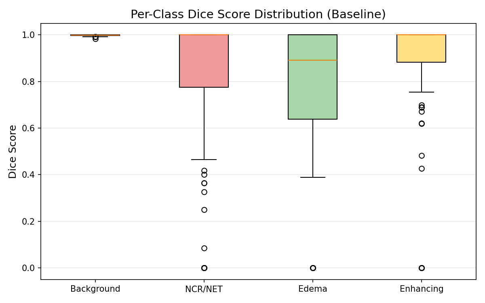
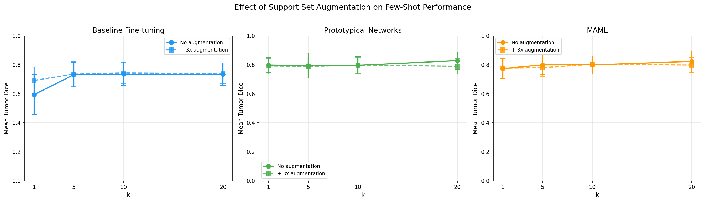

# Few-Shot Brain Tumor Segmentation with Meta-Learning

**CS7150 Deep Learning — Final Project**
**Yuzhe Li & Sherwin Vahidimowlavi | Northeastern University | Spring 2026**

Can we segment brain tumors with only 1–20 labeled examples? This project compares three few-shot adaptation strategies on the BraTS 2020 dataset: fine-tuning baseline, prototypical networks with gated attention, and MAML (first-order approximation).

---

## Key Results

| Method | k=1 | k=5 | k=10 | k=20 |
|---|---|---|---|---|
| Baseline Fine-tuning | 0.595 ± 0.137 | 0.732 ± 0.083 | 0.736 ± 0.078 | 0.735 ± 0.078 |
| **Prototypical Networks** | **0.799 ± 0.052** | 0.795 ± 0.086 | 0.797 ± 0.061 | **0.829 ± 0.059** |
| MAML (FOMAML) | 0.775 ± 0.070 | **0.800 ± 0.067** | **0.800 ± 0.061** | 0.823 ± 0.072 |

*Mean Tumor Dice Score (classes 1–3), 50 episodes per k value.*

Both meta-learning methods significantly outperform the baseline at every k, with the largest gap at k=1 (+0.204 for prototypical). Full supervision Dice: 0.737.


---

## Project Structure

```
UNet-FewShot/
├── configs/
│   ├── config.py              # Centralized hyperparameters and paths
│   ├── metrics.py             # Dice score, HD95, full evaluation loop
│   ├── model_utils.py         # Shared checkpoint loading
│   └── results_utils.py       # Shared JSON save/load/print utilities
├── data/
│   ├── dataset.py             # BraTSDataset — loads FLAIR + T1CE slices
│   ├── splits.py              # Consistent 70/20/10 train/val/test splits
│   ├── few_shot_sampler.py    # Episode sampling + k-shot fine-tune eval
│   ├── augmented_finetune.py  # Support set augmentation for all methods
│   └── synthetic_tumor_generator.py  # Synthetic tumor generation (experimental)
├── models/
│   ├── bu_net.py              # BUNet — ResNet34 U-Net baseline
│   ├── prototypical_segmentation.py  # Gated prototype-attention network
│   └── maml_segmentation.py   # FOMAML wrapper + trainer
├── training/
│   ├── trainer.py             # Supervised training loop (Dice loss)
│   └── prototypical_trainer.py # Episodic training with BN freeze
├── notebooks/
│   ├── 1_baseline_training.ipynb      # Train supervised U-Net
│   ├── 2_baseline_evaluation.ipynb    # K-shot fine-tuning evaluation
│   ├── 3_prototypical_training.ipynb  # Train + evaluate prototypical net
│   ├── 4_maml_training.ipynb          # Train + evaluate MAML
│   ├── 5_interpretability.ipynb       # Visualizations + method comparison
│   └── 6_augmentation_ablation.ipynb  # Support set augmentation experiment
├── results/                   # Saved JSON metrics + PNG figures
├── checkpoints/               # Model checkpoints (gitignored)
└── .gitignore
```

---

## Methods

### Baseline: Fine-Tuning
Pretrained ResNet34 U-Net (24.4M params). For each episode, deep-copy the model, fine-tune on k support slices for 10 gradient steps, then evaluate on query slices.

### Prototypical Networks (Gated Attention)
Compute per-class prototypes by masked averaging of encoder features from the support set. Generate cosine similarity attention maps and fuse with U-Net output:

```
output = UNet(query) × (1 + σ(gate) × attention)
```

The learnable gate starts at 0 (pure U-Net) and learns when to incorporate prototype guidance. BatchNorm layers are frozen during episodic training to preserve pretrained running statistics.

### MAML (First-Order Approximation)
First-order MAML (FOMAML) with 5 inner-loop SGD steps on the support set. Due to architectural constraints with SMP's U-Net, the outer loop trains on concatenated support+query data rather than backpropagating through the inner loop. This limitation is documented as a finding.

---

## Key Findings

1. **Preserving pretrained features > adaptation mechanism.** Both prototypical and MAML achieve ~0.80 Dice by avoiding destructive fine-tuning, while the baseline degrades to 0.595 at k=1 due to overfitting.

2. **Gated attention is critical.** Ungated prototype attention destroys the U-Net's calibration — Dice dropped to 0.248 without the gate. The gate learned to start conservative and rely primarily on U-Net features.

3. **Support set augmentation only helps when overfitting is the bottleneck.** Augmentation improved baseline k=1 by +0.098 but provided no benefit to prototypical/MAML, which already preserve pretrained features.

4. **Prototype resolution bottleneck.** Small tumor subregions (edema, enhancing) vanish when masks are downsampled to the encoder's 4×4 spatial resolution, producing empty prototypes for those classes.

5. **FOMAML limitation.** The first-order approximation collapses to standard training. Despite this, results are strong because the pretrained ImageNet backbone already provides a good initialization.

---

## Setup

### Requirements
```
torch >= 2.0
segmentation-models-pytorch
nibabel
opencv-python
scikit-learn
scipy
kagglehub
tqdm
matplotlib
```

### Installation
```bash
git clone https://github.com/sherwinvahidi/UNet-FewShot.git
cd UNet-FewShot
pip install -r requirements.txt
```

### Dataset
The BraTS 2020 dataset is downloaded automatically via KaggleHub on first run. You need a Kaggle account with the dataset accepted:
1. Go to [BraTS2020 on Kaggle](https://www.kaggle.com/datasets/awsaf49/brats20-dataset-training-validation)
2. Accept the dataset terms
3. Set up Kaggle API credentials (`~/.kaggle/kaggle.json`)

### Running
Execute notebooks in order:
```
1_baseline_training.ipynb      → trains the U-Net baseline (~15 hours on MPS)
2_baseline_evaluation.ipynb    → k-shot fine-tuning evaluation (~2 hours)
3_prototypical_training.ipynb  → episodic training + evaluation (~1 hour)
4_maml_training.ipynb          → MAML training + evaluation (~1 hour)
5_interpretability.ipynb       → generates all comparison figures
6_augmentation_ablation.ipynb  → augmentation experiment (~3 hours)
```

All notebooks use `sys.path.append('..')` to import from the project root. Run them from inside the `notebooks/` directory.

---

## Results Gallery

### Method Comparison


### Prediction Visualization


### Per-Class Error Analysis


### Augmentation Ablation


---

## References

- Finn, C., Abbeel, P., & Levine, S. (2017). *Model-Agnostic Meta-Learning for Fast Adaptation of Deep Networks.* ICML.
- Snell, J., Swersky, K., & Zemel, R. (2017). *Prototypical Networks for Few-Shot Learning.* NeurIPS.
- Hu, Q., et al. (2022). *Synthetic Tumors Make AI Segment Tumors Better.* arXiv:2210.14845.
- Balasundaram, A., et al. (2023). *A Foreground Prototype-Based One-Shot Segmentation of Brain Tumors.* Diagnostics.
